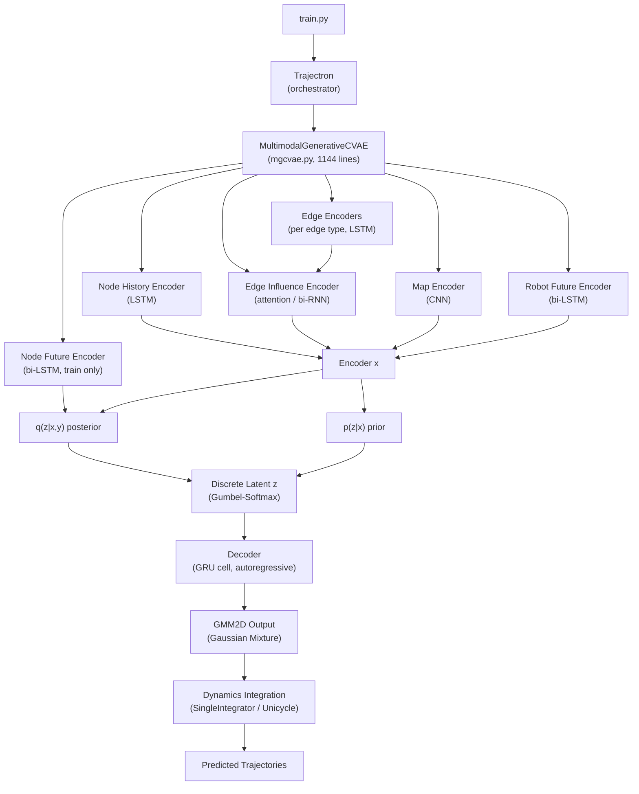

# Trajectron++ — Repository Structure

## What Is This Project?

Trajectron++ is a **trajectory forecasting model** from the ECCV 2020 paper *"Trajectron++: Dynamically-Feasible Trajectory Forecasting With Heterogeneous Data"* by Salzmann, Ivanovic, Chakravarty, and Pavone (Stanford / NVIDIA). Given observed past motion of agents (pedestrians or vehicles), it predicts a **distribution** of plausible future trajectories using a Conditional Variational Autoencoder (CVAE) with graph-structured social interactions.

> **Note:** The original codebase targeted Python 3.6 + TensorFlow 1.14. This copy has been **modernized to Python 3.10** with PyTorch 1.13 — all changes are documented in [CHANGES_TRACK.md](CHANGES_TRACK.md).

---

## Top-Level Layout

```
Trajectron-plus-plus/
├── trajectron/          # 🧠 Core library — model, data structures, training
├── experiments/         # 🧪 Dataset-specific scripts, raw data, pretrained models, results
├── config/              # ⚙️  Default hyperparameter configs (JSON)
├── img/                 # 📷 Repo banner image
├── requirements.txt     # 📦 Python dependencies (updated for 3.10)
├── CHANGES_TRACK.md     # 📝 Pipeline guide + all code changes log
├── REPO_STRUCTURE.md    # 📖 This file
├── README.md            # Original project README
└── .venv/               # Virtual environment (managed via uv)
```

---

## 1. `trajectron/` — Core Library

This is the heart of the project. Everything else calls into here.

```
trajectron/
├── train.py                    # Entry point: training loop
├── test_online.py              # Entry point: streaming/online inference demo
├── argument_parser.py          # CLI argument definitions
├── model/                      # Neural network architecture
│   ├── trajectron.py           # Top-level model orchestrator
│   ├── mgcvae.py               # MultimodalGenerativeCVAE — the actual model (1144 lines)
│   ├── model_registrar.py      # Parameter registry for saving/loading
│   ├── model_utils.py          # Helpers (annealing, LR scheduling, RNN utils)
│   ├── components/             # Reusable neural network building blocks
│   │   ├── additive_attention.py
│   │   ├── discrete_latent.py  # Discrete latent variable (Gumbel-Softmax)
│   │   ├── gmm2d.py            # 2D Gaussian Mixture Model output distribution
│   │   ├── graph_attention.py  # Graph attention for edge influence
│   │   └── map_encoder.py      # CNN encoder for HD map patches
│   ├── dynamics/               # Physics-based motion models
│   │   ├── dynamic.py          # Base class
│   │   ├── linear.py           # Identity (no dynamics)
│   │   ├── single_integrator.py # Velocity → position integration
│   │   └── unicycle.py         # Unicycle model for vehicles
│   ├── dataset/                # PyTorch Dataset + collation
│   │   ├── dataset.py          # EnvironmentDataset (wraps scenes into batches)
│   │   ├── preprocessing.py    # Batching, scene graph queries, standardization
│   │   └── homography_warper.py # Spatial transformer for map crops
│   └── online/                 # Streaming inference variants
│       ├── online_trajectron.py
│       └── online_mgcvae.py
├── environment/                # Scene representation & data structures
│   ├── environment.py          # Top-level Environment (holds scenes, node types)
│   ├── scene.py                # Scene (one continuous recording segment)
│   ├── node.py                 # Node (one tracked agent — pedestrian or vehicle)
│   ├── node_type.py            # Enum for agent types
│   ├── scene_graph.py          # Spatiotemporal scene graph (adjacency by distance)
│   ├── data_structures.py      # Ring buffer, DoubleHeaderNumpyArray
│   ├── data_utils.py           # Small data helpers
│   └── map.py                  # Map representation (for nuScenes)
├── evaluation/
│   └── evaluation.py           # ADE, FDE, KDE NLL computation + TensorBoard logging
├── visualization/
│   ├── visualization.py        # Matplotlib trajectory plotting
│   └── visualization_utils.py  # Color/line helpers
└── utils/
    ├── matrix_utils.py         # Block diagonal matrix construction
    ├── os_utils.py             # File path helpers
    └── trajectory_utils.py     # prediction_output_to_trajectories()
```

### Architecture Flow



### Key Design Decisions

| Aspect | Choice | Why |
|---|---|---|
| **Latent variable** | Discrete (Gumbel-Softmax), N×K grid | Captures distinct behavioral modes (go left vs. right) |
| **Decoder** | Autoregressive GRU | Each future step conditions on previous prediction |
| **Output distribution** | 2D GMM per timestep | Bivariate Gaussian mixture allows correlated x/y uncertainty |
| **Scene graph** | Distance-based, directed edges | Models social interactions (who influences whom) |
| **Dynamics** | Pluggable (Linear / SingleIntegrator / Unicycle) | Ensures physical plausibility; Unicycle for vehicles |

---

## 2. `experiments/` — Dataset-Specific Code

```
experiments/
├── pedestrians/
│   ├── raw/                    # Raw trajectory text files
│   │   ├── eth/  hotel/  univ/  zara1/  zara2/
│   │   └── (each has train/ val/ test/ subdirs with .txt files)
│   ├── process_data.py         # Raw .txt → .pkl conversion
│   ├── evaluate.py             # Run model, compute ADE/FDE/KDE metrics → CSV
│   ├── predict.py              # Run model, save raw predicted trajectories → CSV
│   ├── Result Analysis.ipynb   # Jupyter notebook for result visualization
│   ├── models/                 # Pretrained model checkpoints + configs
│   └── results/                # Evaluation output CSVs
├── nuScenes/
│   ├── process_data.py         # nuScenes SDK → .pkl conversion
│   ├── evaluate.py             # Vehicle/pedestrian evaluation
│   ├── helper.py               # nuScenes-specific utilities
│   ├── kalman_filter.py        # Kalman filter baseline
│   ├── devkit/                 # Git submodule: nuscenes-devkit
│   ├── NuScenes Qualitative.ipynb
│   ├── NuScenes Quantitative.ipynb
│   ├── models/                 # Pretrained model configs
│   └── results/
└── processed/                  # Output of process_data.py (.pkl files)
```

### Data Pipeline

| Stage | Input | Script | Output |
|---|---|---|---|
| **Raw** | `.txt` (frame, track, x, y) | — | Human-readable positions |
| **Process** | Raw `.txt` | `process_data.py` | `.pkl` files with `Environment` → `Scene` → `Node` hierarchy |
| **Train** | `.pkl` | `trajectron/train.py` | Model checkpoints (`.pt`) + TensorBoard logs |
| **Evaluate** | `.pkl` + checkpoints | `evaluate.py` | Error metric CSVs (ADE, FDE, KDE NLL) |
| **Predict** | `.pkl` + checkpoints | `predict.py` | Raw trajectory coordinate CSVs |

---

## 3. `config/` — Hyperparameter Configs

Two default configs:

| File | Purpose | Key Settings |
|---|---|---|
| `config.json` | Pedestrian default | prediction_horizon=12, SingleIntegrator dynamics, PEDESTRIAN state = [pos, vel, acc] |
| `nuScenes.json` | nuScenes (vehicles) | Uses Unicycle dynamics, includes VEHICLE node type |

Config highlights from `config.json`:
- **Prediction horizon**: 12 timesteps × 0.4s = **4.8 seconds** into the future
- **History**: 1–8 past timesteps (0.4s–3.2s)
- **Latent space**: N=1 category with K=25 classes (discrete)
- **Decoder**: 128-dim GRU
- **Encoders**: 32-dim LSTMs for history, future, and edges
- **KL annealing**: Sigmoid schedule, crossover at step 400

---

## 4. Key Dependencies

From `requirements.txt`:

| Package | Version | Role |
|---|---|---|
| `torch` | 1.13.1 | Core deep learning framework |
| `numpy` | 1.24.4 | Array operations |
| `pandas` | 1.5.3 | Data manipulation (evaluation results) |
| `scipy` | 1.10.1 | KDE for evaluation metrics |
| `matplotlib` | 3.7.5 | Visualization |
| `seaborn` | 0.13.2 | Statistical plots |
| `tensorboardX` | 2.6.2.2 | Training logging |
| `dill` | 0.3.8 | Serialization of Environment objects (.pkl) |
| `scikit-learn` | 1.3.2 | Used in data processing |
| `opencv-python` | 4.9.0.80 | Map image processing (nuScenes) |
| `nuscenes-devkit` | 1.2.0 | nuScenes dataset API |

> **Important:** The original project used TensorFlow 1.14 + Python 3.6. Those have been completely removed. The codebase is now **pure PyTorch**.

---

## 5. File Size / Complexity Guide

| File | Lines | Description |
|---|---|---|
| `trajectron/model/mgcvae.py` | **1,144** | The core model — by far the most complex file |
| `trajectron/train.py` | 442 | Training loop with eval + visualization |
| `trajectron/environment/scene_graph.py` | ~500 | Spatiotemporal neighbor graph construction |
| `trajectron/model/dataset/preprocessing.py` | ~300 | Data batching and standardization |
| `trajectron/model/online/online_mgcvae.py` | ~600 | Online inference variant of MGCVAE |
| `experiments/nuScenes/process_data.py` | ~500 | nuScenes → pkl conversion (complex) |
